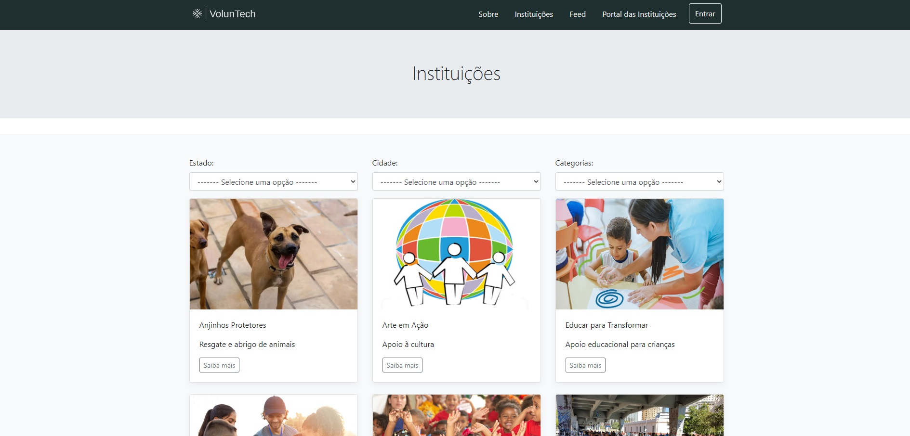

# Programação de Funcionalidades

## Tela inicial (index) (RF-000)

#### Responsável: Frederico Karklin

### Requisito atendido
RF-000: A aplicação deve possuir uma página inicial contendo hyperlinks para as demais features do site.

<figure> 
   

### Artefatos da funcionalidade
<ul>
  <li>index.html</li>
  <li>styles.css</li>
</ul>

### Estrutura de Dados
<ul>
  <li>index.html</li>
</ul>

### Instruções de acesso

Abra um navegador de Internet e informe a seguinte URL: https://github.com/ICEI-PUC-Minas-PMV-ADS/pmv-ads-2024-1-e1-proj-web-t14-voluntech/blob/main/codigo-fonte/index.html

## Tela de cadastro de instituições (index) (RF-01)

#### Responsável: João e Lucas

O acesso à tela de cadastro ocorrerá através da navbar, ao clicar no texto “Portal das instituições”. Além disso, poderá ser acessado ao clicar no botão “Não possui conta? Clique aqui!”  contida na página de Login.

<figure> 
   

### Requisito atendido
RF-01: Criar um mecanismo para cadastro das instituições de caridade.

### Artefatos da funcionalidade
<ul>
  <li>portal-das-instituicoes.html</li>
  <li>styles.css</li>
</ul>

### Estrutura de Dados
<ul>
  <li>portal-das-instituicoes.html</li>
</ul>

### Instruções de acesso

Abra um navegador de Internet e informe a seguinte URL: https://github.com/ICEI-PUC-Minas-PMV-ADS/pmv-ads-2024-1-e1-proj-web-t14-voluntech/blob/main/codigo-fonte/src/atualizacao-de-cadastro.html

## Tela de Instituições (RF-02)

#### Responsável: Lis

O acesso à tela de cadastro poderá ser feito através da opção de menu “Busque por instituições” na tela inicial (index). Além disso, poderá ser acessada ao clicar no texto “Instituições” contido na navbar. As estruturas de dados foram baseadas em HTML, CSS e JS.

<figure> 
   

### Requisito atendido
RF-02: Criar um mecanismo (catálogo) para exibir as instituições cadastradas disponíveis para voluntariado/doações.

### Artefatos da funcionalidade
<ul>
  <li>cards.html</li>
  <li>styles.css</li>
</ul>

### Estrutura de Dados
<ul>
  <li>cards.html</li>
</ul>

### Instruções de acesso

Abra um navegador de Internet e informe a seguinte URL: https://github.com/ICEI-PUC-Minas-PMV-ADS/pmv-ads-2024-1-e1-proj-web-t14-voluntech/blob/main/codigo-fonte/src/instituicoes.html

## Tela de Feed de Necessidades (RF-03 e RF-04)

#### Responsável: Pedro

O acesso a tela de Feed de necessidades poderá ser acessada ao clicar no texto “Feed” contido na navbar.  As estruturas de dados foram baseadas em HTML, CSS e JS.

<figure> 
   

### Requisito atendido
<ul>
  <li>RF-03: Criar um mecanismo para postagem de necessidades das instituições de caridade.</li>
  <li>RF-04: Criar um mecanismo (feed) para exibir as postagens das necessidades das instituições de caridade.</li>
</ul>

### Artefatos da funcionalidade
<ul>
  <li>feed.html</li>
  <li>styles.css</li>
</ul>

### Estrutura de Dados
<ul>
  <li>feed.html</li>
</ul>

### Instruções de acesso

Abra um navegador de Internet e informe a seguinte URL: https://github.com/ICEI-PUC-Minas-PMV-ADS/pmv-ads-2024-1-e1-proj-web-t14-voluntech/blob/main/codigo-fonte/src/feed.html

## Tela de Sobre (RF-07)

#### Responsável: Tatiana

O acesso à tela de cadastro poderá ser feito ao clicar no botão “Saiba mais” na tela inicial (index). Além disso, poderá ser acessada ao clicar no texto “Sobre” contido na navbar.  As estruturas de dados foram baseadas em HTML, CSS e JS.

<figure> 
   

### Requisito atendido

RF-07: Criar uma página contendo informações a respeito da VolunTech.

### Artefatos da funcionalidade
<ul>
  <li>sobre.html</li>
  <li>styles.css</li>
</ul>

### Estrutura de Dados
<ul>
  <li>sobre.html/li>
</ul>

### Instruções de acesso

Abra um navegador de Internet e informe a seguinte URL: https://github.com/ICEI-PUC-Minas-PMV-ADS/pmv-ads-2024-1-e1-proj-web-t14-voluntech/blob/main/codigo-fonte/src/sobre.html

## Tela de Login (RF-08)

#### Responsável: Tatiana

O acesso à tela de login poderá ser feito ao clicar no botão “Entrar” contido na navbar. As estruturas de dados foram baseadas em HTML, CSS e JS.

<figure> 
   

### Requisito atendido

RF-08: Criar uma página de login para as instituições de caridade.

### Artefatos da funcionalidade
<ul>
  <li>login.html</li>
  <li>styles.css</li>
</ul>

### Estrutura de Dados
<ul>
  <li>login.html</li>
</ul>

### Instruções de acesso

Abra um navegador de Internet e informe a seguinte URL: https://github.com/ICEI-PUC-Minas-PMV-ADS/pmv-ads-2024-1-e1-proj-web-t14-voluntech/blob/main/codigo-fonte/src/login.html

