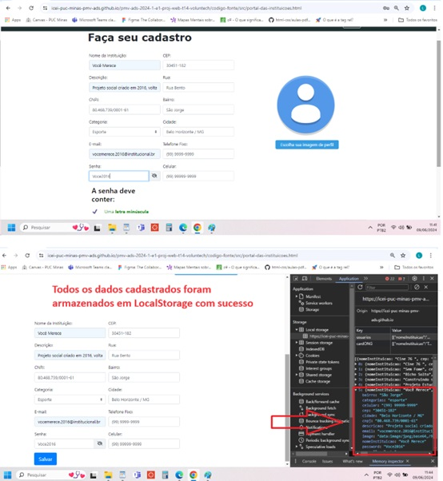

# Registro de Testes de Software

Relatório com as evidências dos testes de software realizados na aplicação pela equipe, baseado no plano de testes pré-definido.

Os resultados dos testes funcionais realizados na aplicação são descritos a seguir. 
  

<h1>CT-01</h1>

|Caso de Teste    | CT-01: Verificar o funcionamento dos links da página home |
|:---|:---|
| Resultados obtidos | Satisfatório  |
| Responsável pela execução do caso de Teste | Pedro |

Objetivo: Validar o funcionamento dos links da página home.

Procedimento:
1.	Acessar o navegador.
2.	Informar o endereço do site.
3.	Visualizar a página home.
4.	Testar o redirecionamento em Saiba mais para a página sobre nós.
5.	Testar o redirecionamento clicando “Busque por instituições”.
6.	Testar o redirecionamento clicando em “Ajude de outra forma”.
7.	Testar o redirecionamento clicando em “Cadastrar instituição”.
8.	Testar o redirecionamento da Navbar.
9.	Responsividade em telas menores.
10.	Teste em outros navegadores.

Resultados:

●	Todos os links da página home encaminharam para as respectivas páginas corretamente.

●	Não foram encontrados links quebrados ou que direcionassem para páginas erradas.

●	Obs: Quando a página foi redirecionada para a tela de Sobre Nós em telas menores (para smartphones), foi detectado que a imagem sobrescreve o conteúdo.

<h3>Avaliação:</h3>O teste de validação de links na página home foi bem-sucedido. Todos os links estão funcionando corretamente e direcionando para as páginas esperadas.
  
  
<h1>CT-02</h1>

|Caso de Teste    | CT-02: Verificar o funcionamento dos campos do formulário de atualização de cadastro e botão de voltar para página feed |
|:---|:---|
| Resultados obtidos | Satisfatório  |
| Responsável pela execução do caso de Teste | Lis |

Tela inicial de atualização de cadastro da instituição logada:
 

Mensagem que notifica caso o usuário não preencha um ou mais campos:
 
 

Mensagem de atualização de cadastro.
 

Cadastro atualizado na local storage.
 
 
O botão destacado redireciona para a página do feed.
  
  
<h1>CT-03</h1>

|Caso de Teste    | CT-03: Verificar a exibição das instituições cadastradas disponíveis para voluntariado/doações e o funcionamento dos filtros |
|:---|:---|
| Resultados obtidos | Não Satisfatório  |
| Responsável pela execução do caso de Teste | Lucas |

Funcionalidades da página Instituições com cards e instituições cadastradas.

 
Ao cadastrar a Instituição seus dados foram armazenados em LocalStorage com sucesso como apresentado acima.

 
Após cadastrado algumas instituições para realização do teste , todas as instituições apareceram com seus cards de forma dinâmica na página instituições.

 
Ao realizar a ação de click em "saiba mais " contido no Card da instituição é aberto um modal com informações contidas no cadastro da instituição, entretanto como visualizado no teste acima 1 e 2 , foi percebido que as informações não estão sendo atualizadas de instituição para instituição contidas em LocalStorage como esperado nessa ação.

 
no caso dos filtros como partilhado nas imagens acima , o filtro classificado como estado teve falha em seu funcionamento, já nos filtros de cidade e categoria obtevesse sucesso em sua funcionalidade.

  
  
<h1>CT-04</h1>

|Caso de Teste    | CT-04: Verificar redimencionamento da página sobre nós para outros tamanhos de tela |
|:---|:---|
| Resultados obtidos | Não Satisfatório  |
| Responsável pela execução do caso de Teste | João |

Imagem VolunTech se mantém estática em todos os navegadores, exceto quando é para o dimensionamento de tablet (768px) e celular (480px) que se sobrepõem.
 
 
 

  
  
<h1>CT-05</h1>

|Caso de Teste    | CT-05: Verificar se ao inserir os dados cadastrados a página efetua o login.  |
|:---|:---|
| Resultados obtidos | Satisfatório  |
| Responsável pela execução do caso de Teste | Lis |

Usuário preenche os campos “email” e “senha” com valores diferentes do já cadastrado
 
Se as informações de usuário forem válidas, o login será bem sucedido:
 
 
Informações armazenadas no LocalStorage do usuário logado.

 

Através do botão destacado acima o usuário é redirecionado para a página de cadastro caso não possua conta:
 

  
  
<h1>CT-06</h1>

|Caso de Teste    | CT-06: Verificar o funcionamento dos campos de cadastro e se estão sendo validados corretamente  |
|:---|:---|
| Resultados obtidos | Satisfatório  |
| Responsável pela execução do caso de Teste | Tatiana |

Verificar se os campos da página de cadastro estão sendo validados corretamente e armazenando os
dados em LocalStorage.

#### RF-001: O cadastro deve ter seus campos validados de forma correta e impedir que o usuário envie dados com o campo vazio.

#### RF-002: O cadastro deve possuir máscaras de formatação para os campos: celular, telefone e senha.

 

#### RF-003: O cadastro precisa ter o campo CEP preenchendo automaticamente os campos de rua, bairro e cidade.

#### RF-004: O cadastro deve direcionar para o login após 3 segundos.

<h3>Avaliação:</h3>Todos os campos da página de cadastro foram validados corretamente, impedindo que o usuário preenchesse campos vazios. Os testes de software mostraram que os requisitos priorizados foram atendidos, funcionando como planejado.
  
  
<h1>CT-07</h1>

|Caso de Teste    | CT-07: Verificar o funcionamento do mecanismo de publicação  |
|:---|:---|
| Resultados obtidos | Satisfatório  |
| Responsável pela execução do caso de Teste | Fred |

 
Tela inicial com mecanismo de postagem de necessidade da instituição logada.

 
Publicação realizada.

